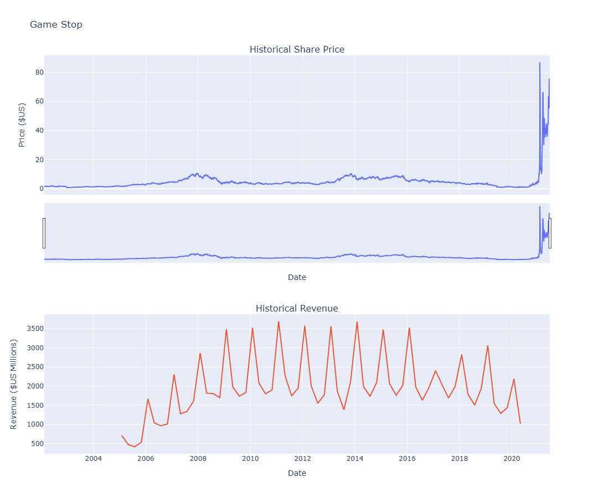
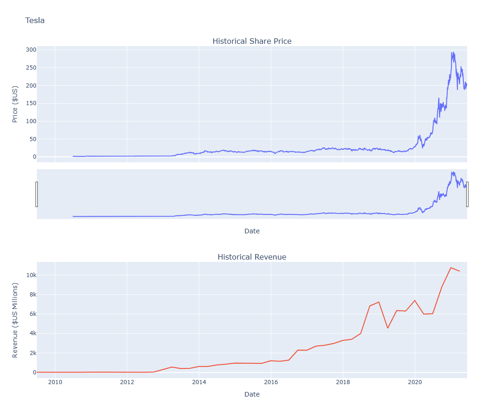

# Historical-Stock-Revenue-Data-

This Repo contains a Jupyter Notebook with a project that analyses historical stock data from Tesla and Game Stop using the Yahoo yfinance library for python, requests lib to do web scraping techniques and plotly libraries to graph the data extracted

due to te use of make_graph the next images will be the result of the Jupyter Notebook after collecting the data, filling new dataframes for analysis and using the make_graph method to see the actual behaviour of each stock 

  

  

